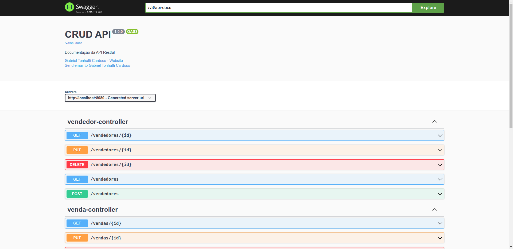

## Executar o projeto

Para rodar o projeto é necessário ter instalado o Java.
Após ter instalado o java no seu computador basta clonar o repositório com o método https ou ssh:

HTTPS:

``` bash
https://github.com/GabrielTonhatti/crud-api.git
```

SSH:

``` bash
git@github.com:GabrielTonhatti/crud-api.git
```

Após entrar dentro da pasta do projeto, basta executar o comando:

``` bash
./mvnw install 
```

Após isso basta executar o comando:

``` bash
java -jar target/crud-api-0.0.1-SNAPSHOT.jar
```

E acessar <a href="http://localhost:8080">localhost:8080</a> para acessar a API, para acessar o Swagger da api basta
acessar <a href="http://localhost:8080/swagger-ui/index.html">localhost:8080/swagger-ui/index.html</a>:



Ou também acessar <a href="https://crud-api-gabrieltonhatti.herokuapp.com/swagger-ui/index.html"> crud-api-gabrieltonhatti.herokuapp.com/swagger-ui/index.html</a>, que é a aplicação hospeada na heroku.